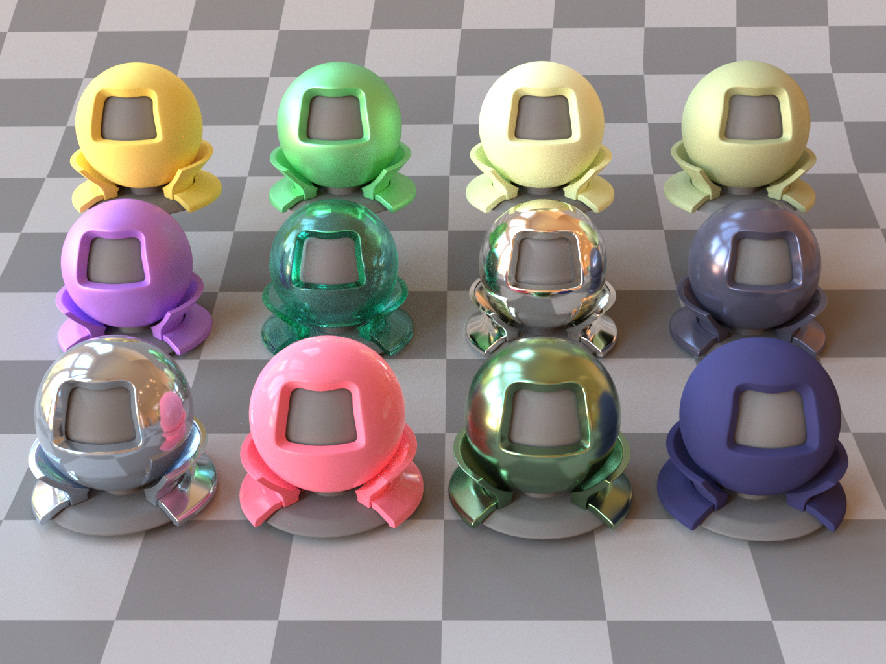
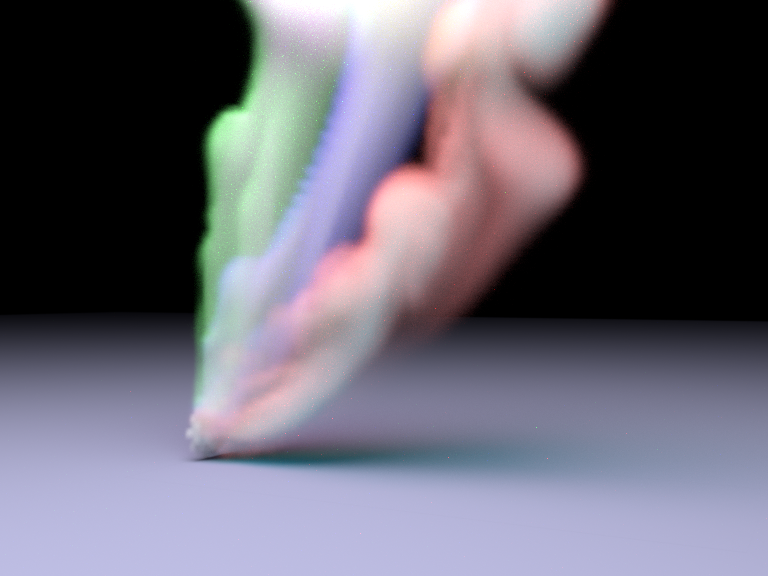

# lajolla Path Tracer

<p align="center">
  
  
</p>

This is the implementation of UCSD CSE 272 course project. It's an advanced path tracer with 2 key features: Disney Principled BSDF and volumetric path tracing.

Other more basic pathtracer features like axis-aligned bounding boxes (AABB), texture mapping, effective sampling, multiple-importance sampling (MIS), next-event estimation (NEE) are implemented in another project: [**Torrey**](https://github.com/Thomaswang0822/torrey_renderer). Those features are provided as starter code by our instructur [Tzu-Mao Li](https://cseweb.ucsd.edu/~tzli/) in **lajolla**.
*FYI: La Jolla and Torrey Pines are the 2 neighborhoods that sandwich UCSD*

## Build & Run

**Filled in .obj files**:

I git-ignored those mesh definition files in my repo, so please head to [the starter code](https://github.com/BachiLi/lajolla_public) and swap in the *scenes* folder.

**This portion is copied from the original README**:

All the dependencies are included. Use CMake to build.
If you are on Unix systems, try

```shell
mkdir build
cd build
cmake ..
cmake --build .
```

It requires compilers that support C++17 (gcc version >= 8, clang version >= 7, Apple Clang version >= 11.0, MSVC version >= 19.14).

Apple M1 users: you might need to build Embree from scratch since the prebuilt MacOS binary provided is built for x86 machines. (But try build command above first.)

**For Windows users, I personally find using Visual Studio easier**:

For Visual Studio 2017 or later, you can directly "Open a local folder" on the clone repo and Visual Studio will configure the rest for you.

If you prefer the OG style that opens a project/solution, you can use CMake-gui to generate a solution definition for you.

1. make sure you have installed CMake and open **CMake (cmake-gui)**
2. Where is the source code: **PATH-TO-ROOT**
3. Where to build the binaries: **PATH_TO_ROOT**/build
4. Configure, Generate, Open Project, Bingo!

**To run**:

Make sure you are at the project root and

```shell
PATH_TO_EXE/lajolla scenes/cbox/cbox.xml
```

## Disney Principled BSDF

Relevant scene definitions are located in *scenes/disney_bsdf_test*;

For the underlying theories and implementation details, see [HW1 handout](https://cseweb.ucsd.edu/~tzli/cse272/wi2024/homework1.pdf) and my code.

## Volumetric Path Tracing

Relevant scene definitions are located in *scenes/volpath_test*;

For the underlying theories and implementation details, see [HW2 handout](https://cseweb.ucsd.edu/~tzli/cse272/wi2024/homework2.pdf) and my code.
